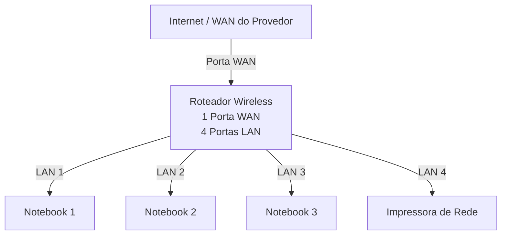
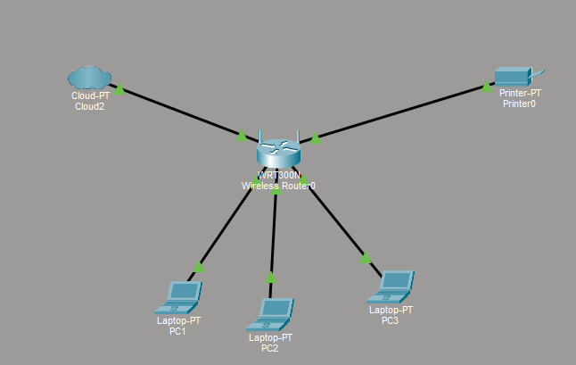

# Laboratório de Redes 01 - Projeto de Rede Local
Projeto desenvolvido na disciplina de Redes de Computadores no Curso Técnico de Informática do SENAC

- Aluno: daniel vieira de oliveira
- Professor: josé de Assis
- Data: 09/03/2026

---

## 1. Objetivo
Implementar uma rede local simples conectando 3 notebooks a um roteador wireless com switch integrado e uma impressora de rede.

O projeto será realizado em duas etapas: 

1. simulação da rede no Cisco Packet Tracer
2. Implementação da rede no laboratório real

---

## 2. Equipamentos Utilizados neste Laboratório

- 3 notebooks
- 1 roteador wireless com 1 porta de WAN e 4 portas de LAN
- 1 impressora de rede
- cabos de rede

---

## 3. Topologia da Rede
Diagrama lógico da rede utilizada nesse laboratório:

---
# Imagem da topologia utilizada no laboratório:

---

## 4. Plano de endereçamento IP 

Rede: 192.168.0.0/24

Gateway: 192.168.0.1

| Dispositivo | Tipo de IP | Endereço IP | Observação |
|-------------|-------------|-------------|-------------|
| Roteador | Estático | 192.168.0.1 | Ip do roteador |
| Impressora | Reserva DHCP | 192.168.0.100 | IP reservado pelo roteador |
| PC1 | Reserva DHCP | 192.168.0.101 | IP reservado pelo roteador |
| PC2 | Reserva DHCP | Automático | IP reservado pelo roteador |
| PC3 | Reserva DHCP | Automático | IP reservado pelo roteador |

**Observação**

- A impressora e um dos notebooks utilizam reserva DHCP
- O roteador sempre atribui o mesmo endereço IP a esses dispositivos.

---

## 5. Implementação no Laboratório Real

Após a instalação , a rede foi montada fisicamente no laboratório. 

Etapas realizadas:

(fotos e caputras de tela realizadas durante o laboratório)

Testes:

(fotos e caputras de tela realizadas durante o laboratório)

---

## 6. Conclusão

Este laboratório permitiu compreender o funcionamento de uma rede local simples, incluindo:

- Estrutura de uma rede doméstica ou de pequeno escritório
- Utilização de um roteador com porta WAN e portas LAN
- funcionamento do DHCP
- Comunicação entre dispositivos na rede local
- Utilização de uma impressora de rede
- compartilhamento de pastas na rede
